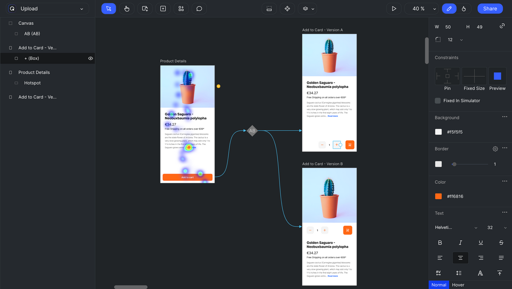

# Getting Started

Quant-UX is a free and open-source research and analysis tool for quantitative analysis of design prototypes.

## Overview

Quant-UX supports building prototypes and sharing it for testing. The screens of the prototypes are composed of basic UI elements called **widgets**. Common examples will be buttons, switches, text field, etc. These are not just visual elements acting as placeholders, but _independent, functional, and customisable components_, which can be used to quickly create highly interactive wireframes and prototypes.

After specifying the required 'Tests', the prototypes can be shared with others for testing by simply **sharing a link**. During the testing user interactions and various analytics metrics are captured, and these results are presented in a easy to analyse dashboards. Quant-UX also supports seeing various test results over the prototype itself to make informed design decisions.

[todo]: mod-image

