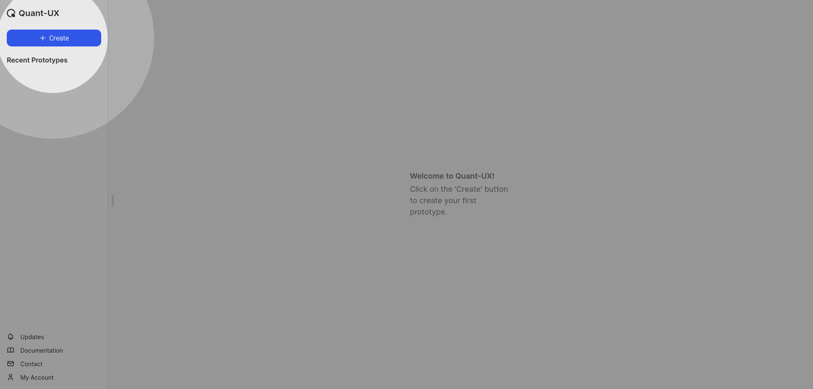
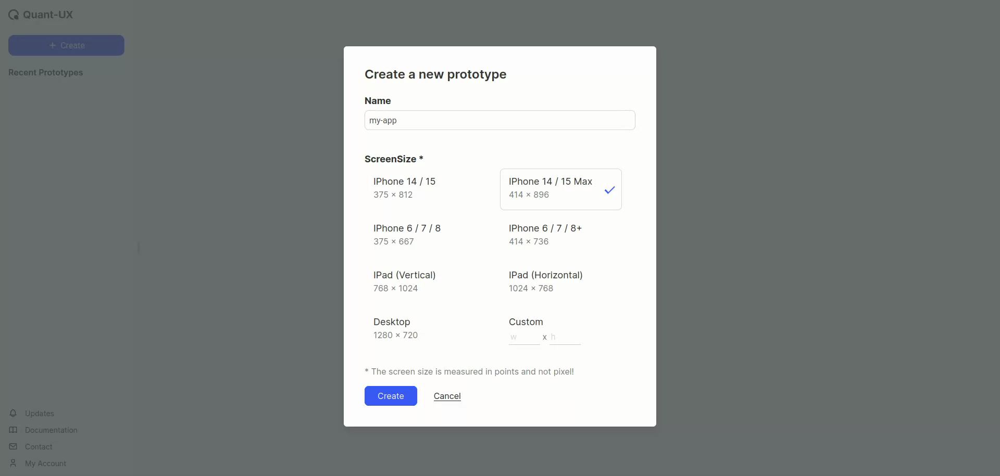
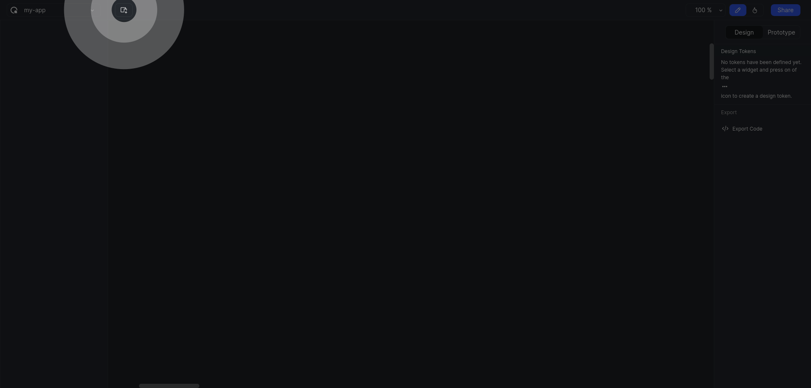

# Create Your First Prototype

After signing in into your account,

1. Click on the **`+ Create`** button in the left panel

2. In the dialogue box, first enter a name. Then either select a screen size or enter custom values as required

3. The app designer will open up. In this, select the **`Add Screen`** button, to insert a screen into the canvas

4. A new screen with the previously selected (Step 2) dimensions will get added

