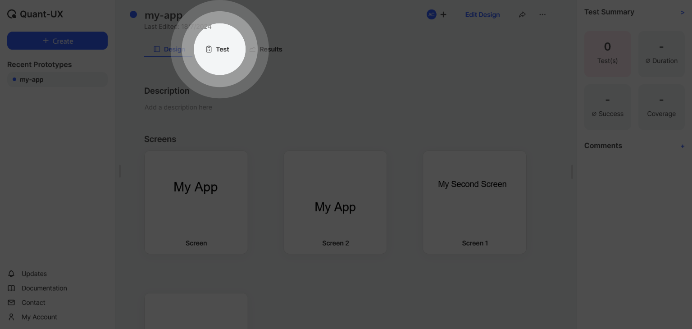
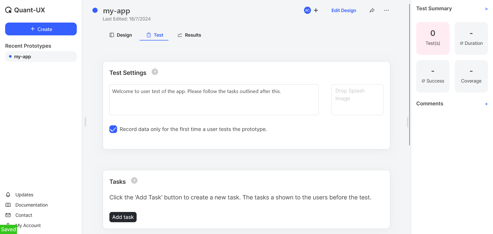
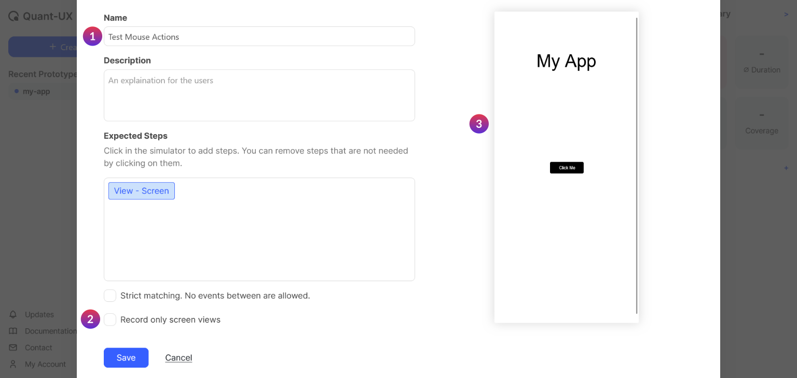
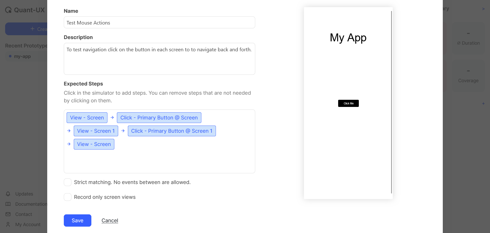

# Create User Tests for Your App

After designing the app, it is time for testing. Usually there will be a set of tasks or steps that need to be evaluated using the prototype. In Quant-UX these tasks can be specified under a test. A test is considered successful when the user manages to perform all the listed tasks.

1. Go back to the prototypes page of prototypes and select the `Test`.

2. Write a welcome message for the user in the box and check the `Record data only for the first time a user tests the prototype`.

3. Click on the `Add Task` button
4. In the new window add a `Task Name`, uncheck the `Record only screen views`.
5. Next specify and record the task, which the user should be completed. To do this simply perform the task on the prototype shown on the right side of this window (3). Each action will be recorded in the `Expected Steps` as a flow.

6. Click on the `Click Me` button in the prototype, which will open up the second screen. Then, click on the `Back` button to come back to the first screen. Ensure that the actions are correctly captured in the `Expected Steps` box.

::: tip
In case of any mistake you can delete specific step and do again. To delete hover over any step in the flow and it will show and option to `Remove`.
:::

7. Add a `Description` for the task so that the user will get a clear idea about the tasks to be performed.

8. Save the task to close the window.
