# Design Your First Prototype

## Quick Demo

<video controls="controls" src="./media/create-user-tests/1-your-first-prototype.webm" />

## Detailed Steps

### Design

After signing in into your account,

1. Click on the **`+ Create`** button in the left panel

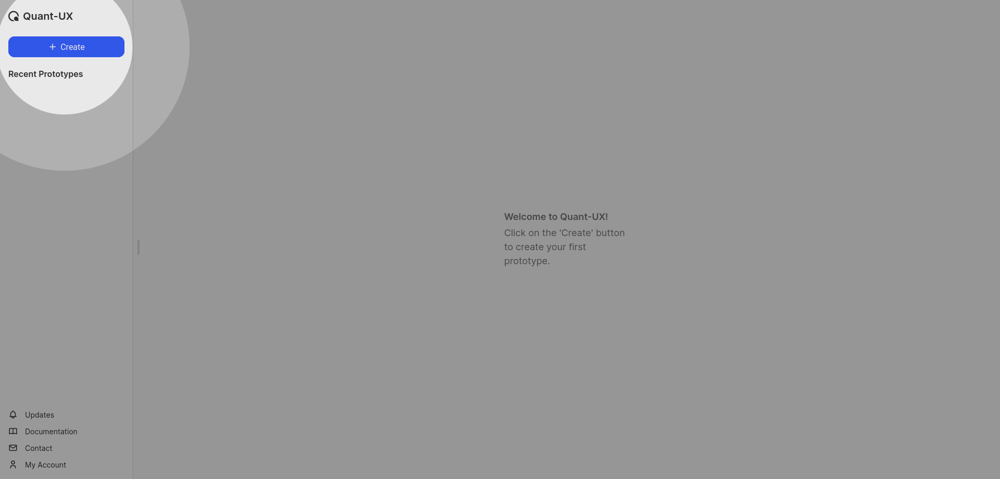

2. In the dialogue box, first enter a name. Then either select a screen size or enter custom values as required

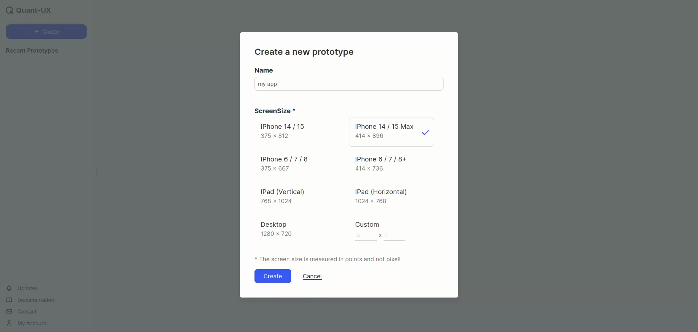

3. The app designer will open up. In this, select the **`Add Screen (s)`** button, to insert a screen into the canvas

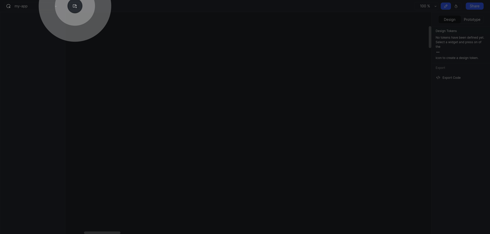

4. A new screen with the previously selected (Step 2) dimensions will get added

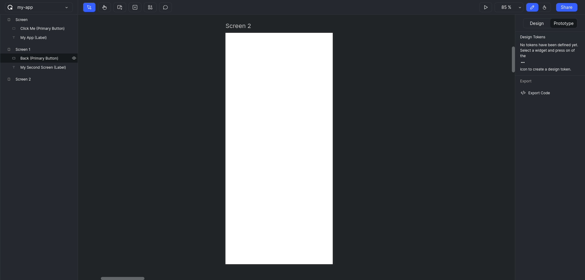

5. Click on `Add Basic Elements` button, and select `Text (T)`. Click and drag to add a text box.

::: warning IMPORTANT
Note that the height of the text box will decide the font size.
:::

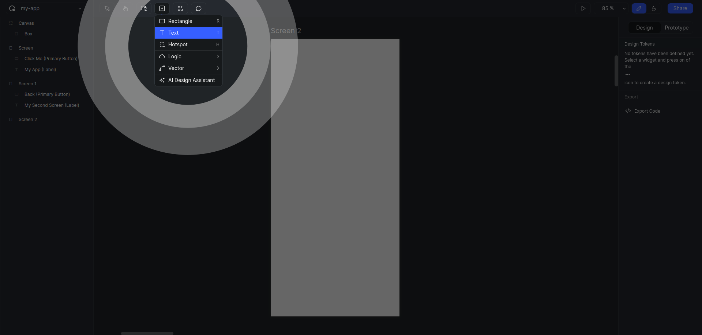

::: tip
You can simply press `T` in your keyboard to activate the type tool.  
Similarly look for shortcuts given with all the tools.
:::

6. Type in a text you want. For example "My App".

7. Click on the `Add Interactive Widgets (W)` button

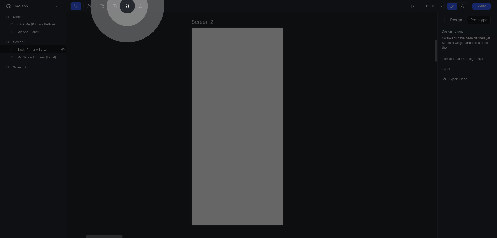

9. Add a `Primary Button` widget into your screen

::: warning IMPORTANT
When clicked on a widget, an instance of that widget will be added to the screen, but this instance will be attached to the mouse pointer. Move the widget to the desired location and click again to fix the position.
:::

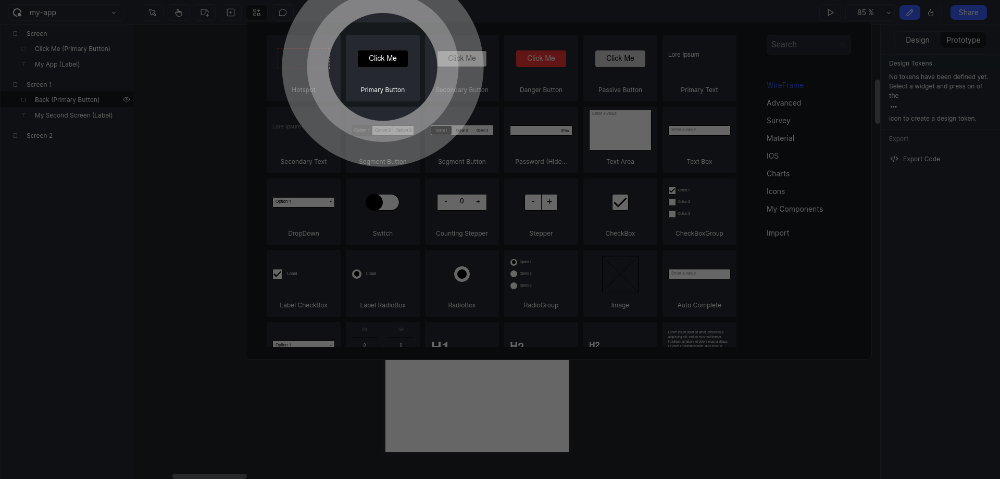

10. Add another screen repeating the same steps used to create the first one.

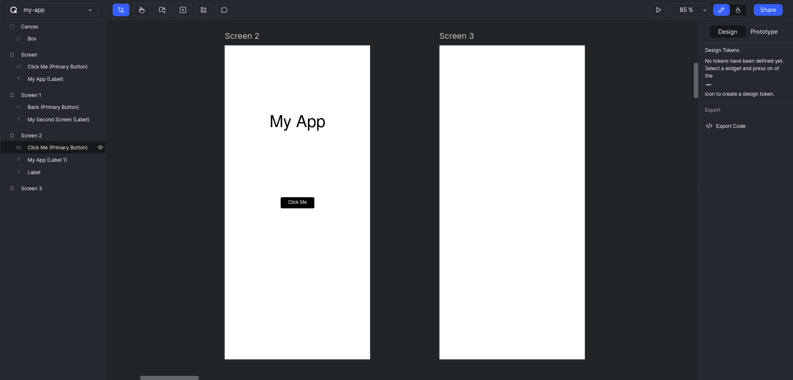

::: tip
You have hold `spacebar` in your keyboard and move the `mouse` to pan in the canvas.
:::

11. Add a text and a `Back` button, to the second screen. `Double Click` on the button to edit the label to "Back".

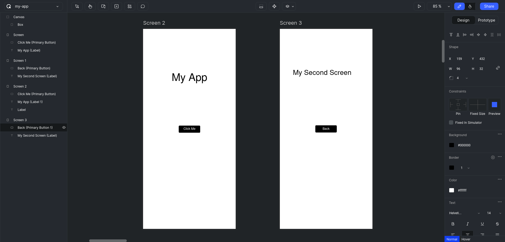

### Prototype

12. Click on the `Prototype` switch in the right sidebar to enter into the prototype mode.

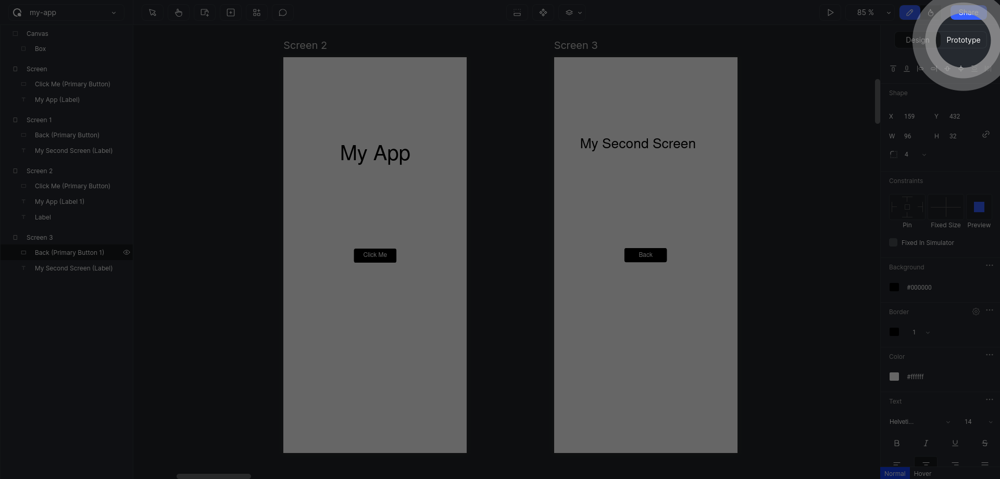

13. Click on the button in the first screen. A `Handle` will be displayed on the middle of the right edge.

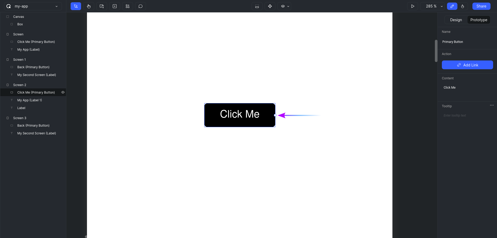

::: tip
You can hold `Ctrl` or `Cmd` on your keyboard and scroll your `Mouse Up` and `Mouse Down` to zoom in and zoom out of the canvas, respectively.
:::

14. Click on the `Handle` once so that a `Wire` will get attached to the mouse pointer. Move the mouse to the second screen and click inside the screen one more time to release the `Wire` and finalise the connection.

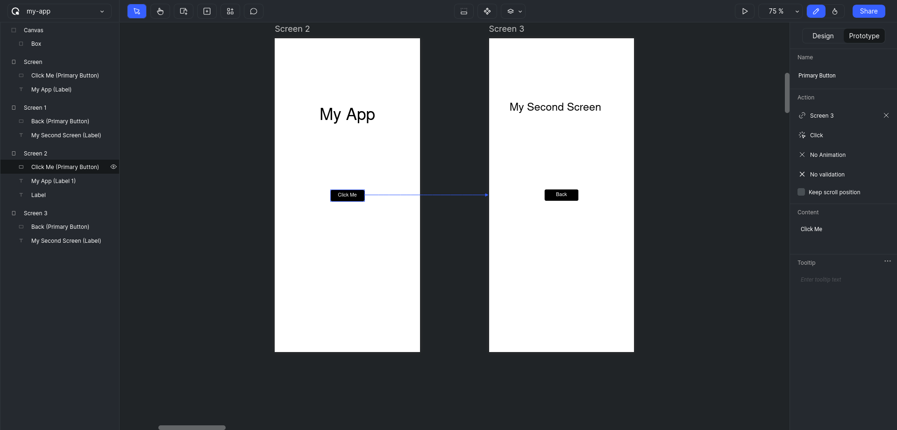

15. Similarly add another connection from back button in the second screen to the first screen.

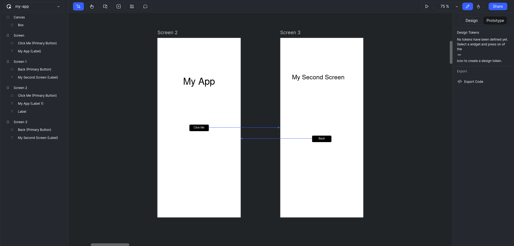

### Simulate

With all the `Wire`s in place, we can simulate the app.

16. Click on the `Start Simulation` button to launch the app in simulation mode.

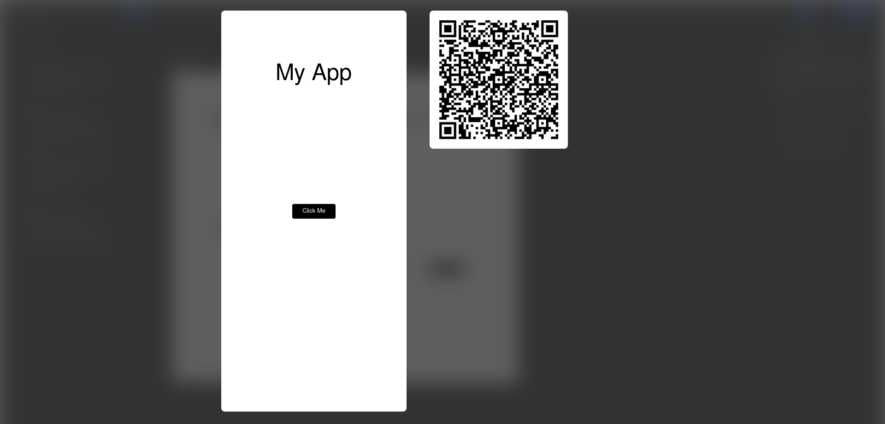

17. Click on the buttons to navigate between the screens.

::: info
Congratulations! First part of your prototype is done. Head over to next section to learn about Testing
:::
